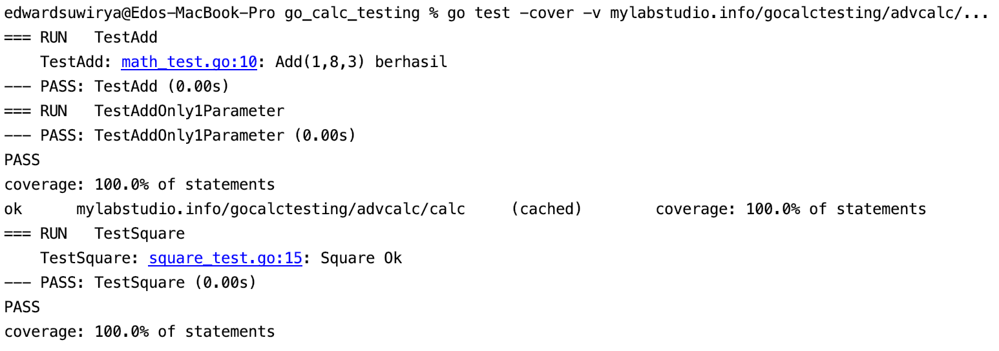

 ## [Golang](https://golang.org/) Test
 ---
 
 Test *all functions*
 ```
  go test -cover -v mylabstudio.info/gocalctesting/advcalc/...
 ```

 Clean test cache
 ```
 go clean -testcache mylabstudio.info/gocalctesting/advcalc/...
 ```